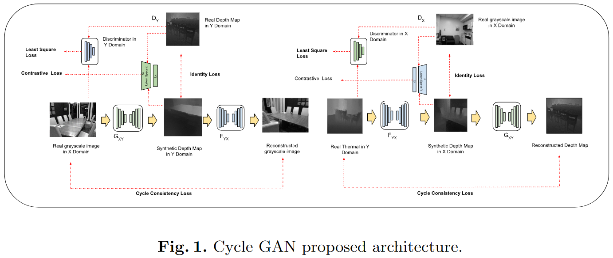
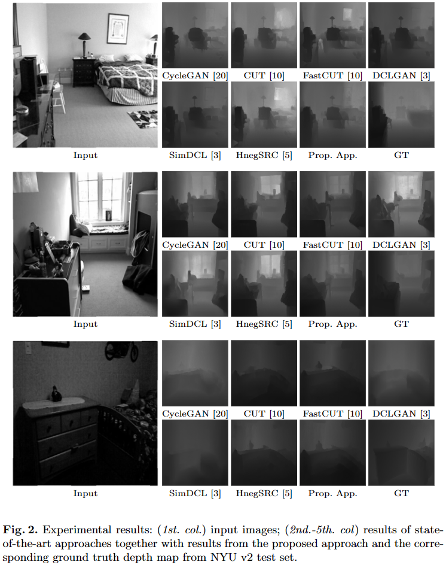
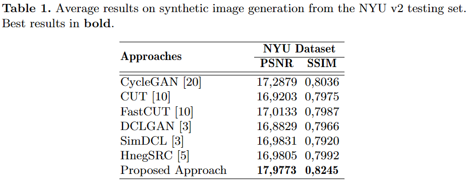

# [A Deep Learning based Approach for Synthesizing Realistic Depth Maps](#) 
This is the official implementation for article "A Deep Learning based Approach for Synthesizing Realistic Depth Maps". Accepted paper on ICIAP 2023.

This paper presents a novel cycle generative adversarial net-work (CycleGAN) architecture for synthesizing high-quality depth maps from a given monocular image.



## Experimental results
Qualitative results:



Quantitative results:



### Dataset
The dataset used is [NYU v2](https://cs.nyu.edu/~silberman/datasets/nyu_depth_v2.html) for training and testing.

### Test
```bash
python test.py --dataroot ./datasets/nyu --name rgb2depth
```

### Train
```bash
python train.py --dataroot ./datasets/nyu --name rgb2depth 
```

### Pre-trained model
To-Do